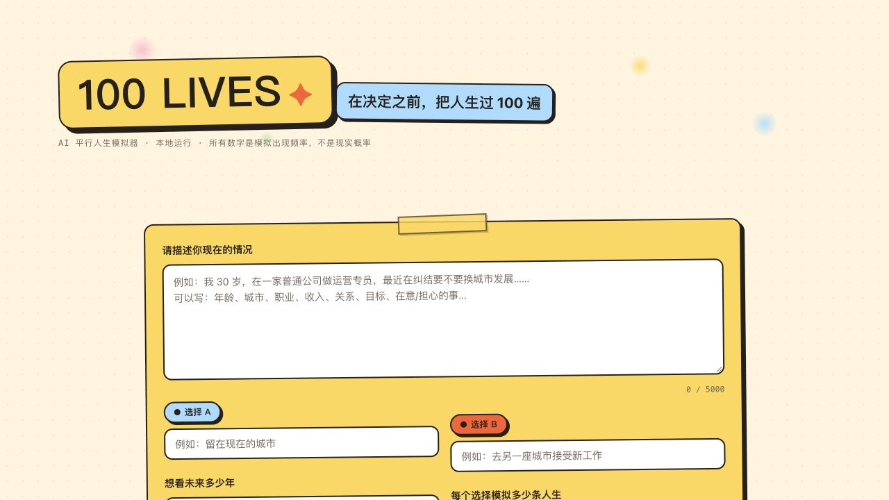
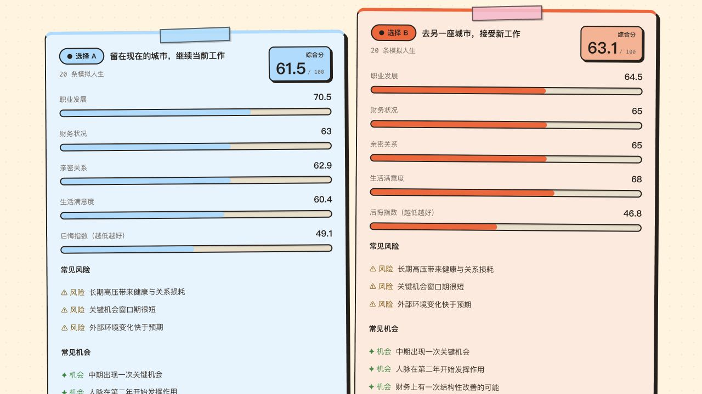
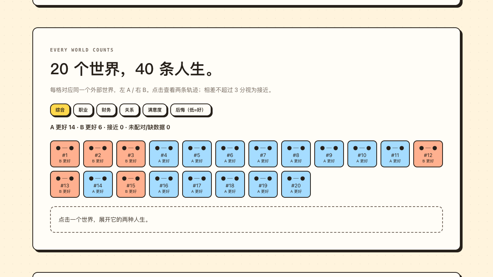
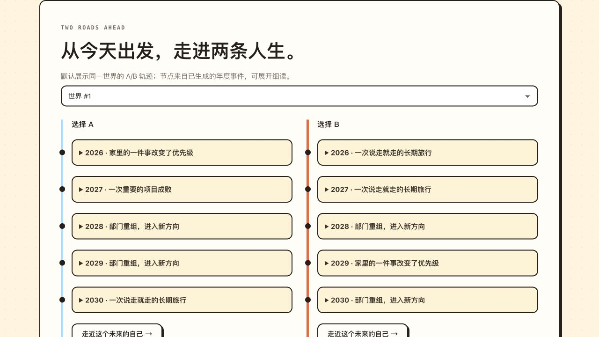

# 100 Lives · 100 个平行人生模拟器

### 在决定之前，把人生过 100 遍。

**如果当时选了另一条路，现在的我会在哪里？**

留在熟悉的城市，还是去远方接受新机会？继续积累，还是重新出发？
写下你的现状和两个选择，让 AI 在相同的外部世界里展开两种人生，再把它们放到一张可探索的网页报告中。

**A/B 人生对照 · 交互世界地图 · 自定义偏好 · 双路线时间线 · 与未来的自己对话**

[看看页面效果](#页面效果) · [本地快速体验](#快速开始) · [Cloudflare 在线版](#cloudflare-在线版) · [了解模拟逻辑](#核心设计)



> ⚠️ 本项目是思想实验与叙事工具，不是预测系统。所有输出由大模型生成，
> 展示的是"N 个模拟世界中的分布"，**不是概率**，更不是命运。

## 页面效果

不是只能从头读到尾的长篇回答，而是一份可以点击、比较、追问和保存的 **HTML 人生报告**。
所有内容在同一个页面连续展示，无需切换阅读模式。

> 以下为当前网页的真实截图。报告使用虚构人物与离线 Mock 模板生成，仅展示界面与交互，不代表真实模型的生成质量。示例为 20 个共享世界 × A/B 两种选择，共 40 条人生；实际数量可配置。

### 看见选择的差别，而不只是一句“建议选 B”

蓝色的 A、橙色的 B：并排比较职业、财务、关系、满意度和后悔程度。
拖动偏好滑块，看看当你更看重某一项时，综合分和世界矩阵如何变化——这一步在浏览器本地计算，不额外调用 AI。



### 一个格子，就是一个“如果”

世界地图把大量轨迹变成可浏览的格子：哪些世界里 A 更好，哪些世界里 B 更好，哪些结果接近？
切换指标，或点开一个世界，查看同样外部条件下的两条人生。



<details>
<summary><strong>继续看：沿着年份走进两条人生</strong></summary>

选择同一个世界，沿 A/B 两条路线查看年度事件。展开节点，了解那一年的职业、生活状态与关键决定；再打开完整轨迹，与那个未来的自己对话。



</details>

**把这次思考带走。** 点击「下载报告」保存单文件 HTML；旁边的「分享海报」可预览并保存包含当前分数与偏好的 PNG 摘要图。离线 HTML 可以浏览报告，未来自己对话仍需后端和模型服务。

**想先试试，不想填 API Key？** 启动 `python run.py --mock`，就能用离线模板体验完整流程。安装步骤见下方「快速开始」。

## 核心设计

- **共享宇宙配对比较**：宇宙 i 中的你既会经历 A 也会经历 B（宏观环境、行业
  冲击、随机事件完全一致），因此对比的是"同一起点下的选择差异"，而不是
  两组不可比样本。
- **质量检查（Critic）**：每条轨迹生成后由独立评审打分（一致性 / 现实感 /
  因果连贯 / 多样性），不通过的轨迹会带着问题清单重新生成，最多重试 2 次。
- **只展示世界数，不展示概率**：界面和报告中的结论一律是
  "X / N 个模拟世界"，频率 ≠ 概率，避免给出虚假的确定性。
- **可以和未来的你聊天**：选中任意一条轨迹，以轨迹终点年份的"你"的口吻
  对话，了解那条人生路的细节。

## 快速开始

需要 Python 3.11+。

```bash
# 1. 安装依赖
pip install -r requirements.txt

# 2. 配置 LLM（三选一）
#    a) 复制 .env.example 为 .env，填入你的 Anthropic Messages 兼容网关：
#         LLM_BASE_URL / LLM_API_KEY / LLM_MODEL
#    b) 不建 .env：程序自动回退读取本机已设置的
#         ANTHROPIC_BASE_URL / ANTHROPIC_API_KEY / ANTHROPIC_MODEL
#    c) 离线试用（内置 Mock，输出为模板内容，不需要任何密钥）：
cp .env.example .env   # 然后编辑，或直接跳到第 3 步用 --mock

# 3. 启动
python run.py            # http://127.0.0.1:8000
python run.py --mock     # 离线 Mock 模式
python run.py --port 8017
```

打开浏览器访问 <http://127.0.0.1:8000>，填写现状描述和两个选择即可开始。

## Cloudflare 在线版

仓库中的 `cloudflare/` 是单独的 Workers AI 体验版，复用 `static/` 的页面和报告格式。它不读取本地 `.env`，也不需要把自己的 API Key 上传到 GitHub 或 Cloudflare。本地 `python run.py` 的配置和完整模拟流程保持原样。

在线地址：[Cloudflare 模拟版](https://100-lives.fduhcshi.workers.dev/)（需要访问密码）；[GitHub Pages 静态展示](https://fduhcshi.github.io/100-lives/)（不调用模型）。

云端版为了控制 Workers AI 免费额度，默认每个选择 2 条人生，最多 3 条、5 年；省去本地版的 Critic 重生成和模型聚类，结果属于小样本体验。一次模拟大约调用 `2 + 2 × num_lives` 次模型，报告通过 Cloudflare Workflows 保存，免费计划完成后只保留 3 天，请及时下载 HTML。实际可用次数由模型的 Neurons 消耗决定，不保证固定每天多少次。与未来自己对话也会额外消耗额度。

### 连接 GitHub 并部署

1. 在 Cloudflare 的 **Workers & Pages → 100-lives → Settings → Builds → Connect** 连接 GitHub 仓库 `fduhcshi/100-lives`，生产分支选 `main`，根目录为仓库根目录。若尚未创建 Worker，也可从 **Create application → Import a repository** 开始。
2. Build command 填 `npm run build:web`，Deploy command 填 `npx wrangler deploy`。`wrangler.jsonc` 已配置静态网页、Workers AI binding 和 Workflow binding。
3. 云端访问使用 Worker 内置的 HTTP Basic 密码保护，无需开通 Zero Trust 或填写付款资料。给 Worker 设置 `SITE_PASSWORD_HASH` Secret，值为共享密码的 SHA-256 小写十六进制摘要。所有网页资源和 API 请求均先验证；用户名固定为 `visitor`。Secret 绝不能放进 Git 仓库。当前部署使用 Wrangler 设置 Secret；以后可以在 Cloudflare 控制台的 Worker 设置中轮换它。
4. 确认密码保护生效后才将 `workers_dev` 设为 `true`，以开放 `workers.dev` 地址。先试一次 2 条人生，再查看 Workers AI 使用量。若模型额度不足，请在 Cloudflare 中调整计划或暂时停止分享链接。

也可在本地用 `npm run build:web && npm run dev:cloudflare` 调试 Worker；发布用 `npm run deploy`。本地调试时把 `SITE_PASSWORD_HASH=...` 放在被 Git 忽略的 `.dev.vars` 文件中。`dev:cloudflare` 会禁止 Wrangler 读取本地 Python 版的 `.env`，避免把私人 API Key 载入云端开发环境。需要 Node.js 20+。Cloudflare 账号登录与 GitHub 授权需要在自己的账号中操作。共享密码适合小范围邀请；若以后要按邮箱分别授权或撤销，再考虑 Zero Trust Access。

### GitHub Pages 展示

仓库的 GitHub Actions 会把同一份首页构建成静态展示页并部署到 GitHub Pages；它不会调用模型。首次使用需要在仓库 **Settings → Pages → Build and deployment** 选择 **GitHub Actions**。在线模拟应使用带访问密码的 Cloudflare 链接，本地完整模拟继续用自己的 API Key。

## 配置项

| 环境变量 | 说明 | 默认 |
|---|---|---|
| `LLM_BASE_URL` | Anthropic Messages 兼容网关地址（`/v1/messages` 可省略） | 回退 `ANTHROPIC_BASE_URL` |
| `LLM_API_KEY` | 网关密钥（只保存在本地 `.env`，已被 .gitignore 排除） | 回退 `ANTHROPIC_API_KEY` |
| `LLM_MODEL` | 模型名 | 回退 `ANTHROPIC_MODEL` |
| `LLM_MOCK` | `1` 时强制离线 Mock | 关 |
| `MAX_CONCURRENCY` | 并发 LLM 请求数上限 | 20 |
| `HOST` / `PORT` | 监听地址 | `127.0.0.1:8000` |

## 运行流程

```
提交请求 → 创建 N 个平行世界 → 并发模拟 A/B（内含 Critic 检查与重生成）
        → 各自聚类 → 配对比较（Δ = Score(Aᵢ) − Score(Bᵢ)）→ 洞察报告 → 落盘
```

- 进度通过 `GET /api/status/{run_id}` 轮询：`universes → simulation →
  clustering → comparison → summary → done / failed`。
- 每次运行完整保存为 `data/runs/{run_id}.json`，同时生成可直接打开的
  `data/runs/{run_id}.html` 单文件报告；刷新页面或重启服务后仍可通过
  `/result/{run_id}` 查看。离线 HTML 可浏览完整报告，未来自己对话仍需启动后端。
- 部分轨迹生成失败时会自动降级（只统计成功配对的世界数），并在报告中说明。

## API 一览

| 方法 | 路径 | 说明 |
|---|---|---|
| POST | `/api/simulate` | 提交模拟（202，后台执行） |
| GET | `/api/status/{run_id}` | 进度与阶段 |
| GET | `/api/result/{run_id}` | 完整结果 JSON |
| GET | `/api/result/{run_id}/html` | 下载单文件 HTML 报告 |
| POST | `/api/future-self-chat` | 与某条轨迹的"未来的你"对话 |
| GET | `/api/health` | 健康检查（含 LLM 是否已配置） |
| GET | `/api/config` | 前端运行模式与规模限制 |

## 测试

结果页为单页连续报告：A/B 总览、偏好调节、世界矩阵、双人生路线与详细分析统一展示，无模式切换或章节翻页。世界矩阵按实际生成的世界展示 A/B 配对，分差不超过 3 分标记为接近；缺失数据单独计数。偏好滑块只在浏览器中重新加权已有结果（后悔反向计分），同步更新总览和世界矩阵，不调用 LLM，刷新后恢复等权。人生路线可逐年展开。下载按钮右侧的「分享海报」可预览并保存 PNG，包含当前偏好；HTML 报告打开时仍默认等权。已有结果无需重新模拟，刷新结果页即可体验。

前端计分与配对逻辑测试：`node tests/result_story.test.cjs`。

```bash
pip install -r requirements-dev.txt
pytest            # 47 个用例，全部离线运行（Mock LLM），约 2 秒
```

## 目录结构

```
app/
  main.py               FastAPI 入口与路由
  config.py             配置（只从环境变量 / .env 读取）
  models/               Pydantic 数据结构（请求 / 轨迹 / 结果）
  prompts/              全部 LLM 提示词（带版本号，集中管理）
  services/             LLM 适配器、宇宙生成、模拟、Critic、聚类、
                        汇总、流水线编排、运行存储、未来对话
  utils/                JSON 解析、重试、日志
static/                 原生 HTML / CSS / JS 前端（无构建步骤）
cloudflare/             Workers AI 在线体验版（Workflow 编排）
scripts/build_web.mjs   构建 Cloudflare 静态资源和 GitHub Pages 展示页
tests/                  pytest 测试套件（离线）
data/runs/              运行结果（JSON，已 gitignore）
run.py                  启动脚本
```

## 边界与免责声明

- 本地版是单人工具：无数据库、无登录、无搜索，数据只存在本机 `data/runs/`。
- 云端版的用户输入会发送到 Cloudflare Workers AI；报告暂存在 Workflow 中。分享云端链接前应设置强访问密码，只发给受邀者。
- 模拟次数有限（默认每选择最多 100 个世界）：小样本下的"X / N"不具备
  统计显著性，请当作发散思考的素材，而不是决策依据。
- 模型可能生成偏颇或不符合你实际情况的叙事，请保持批判性阅读。

## Star History

<!-- 上传前请把本段中所有 YOUR_GITHUB_USERNAME/100-lives 替换成你的真实仓库路径 -->

<picture>
  <source media="(prefers-color-scheme: dark)" srcset="https://api.star-history.com/svg?repos=YOUR_GITHUB_USERNAME/100-lives&type=Date&theme=dark" />
  <source media="(prefers-color-scheme: light)" srcset="https://api.star-history.com/svg?repos=YOUR_GITHUB_USERNAME/100-lives&type=Date" />
  <a href="https://star-history.com/#YOUR_GITHUB_USERNAME/100-lives&Date">
    
  </a>
</picture>
